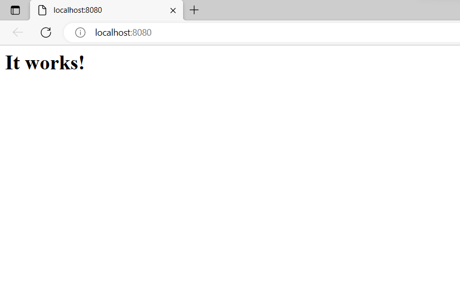

# P05---Despliegue-de-aplicaciones-web-con-docker-compose
P05 - Despliegue de aplicaciones web con docker compose
P05 - Despliegue de escenarios multicontenedor con Docker Compose

Las aplicaciones a desplegar son: 

- Servidor web Apache

Descargamos la imagen httpd:

Para desplegar el contenedor ponemos docker compose up –d (-d es opcional, detached mode sirve para ejecutar contenedores en segundo plano):

Para verlo en la web podemos dar clic derecho en la imagen desde el Visual Studio Code y darle a “Open in Browser” o en el buscador de internet poner localhost:8080:

Datos del docker-compose.yml:

version: '3.1'

services:

`  `apache:

`    `image: httpd:latest

`    `container\_name: my-apache-app

`    `ports:

`    `- '8080:80'

`    `volumes:

`    `- ./website:/usr/local/apache2/htdocs

- Mediawiki 

Descargamos la imagen Mediawiki:

Para desplegar el contenedor ponemos docker compose up –d:

Lo vemos en la web:

Datos del docker-compose.yml:

version: '3.2'

services:

`  `web:

`    `image: mediawiki

`    `ports:

`      `- 80:80

`    `volumes:

`      `#- ./LocalSettings.php:/var/www/html/LocalSettings.php

`      `- database:/var/www/data

`      `- images:/var/www/html/images

volumes:

`    `database:

`    `images:

- Guestbook 

Descargamos la imagen Guestbook:

	

Para desplegar el contenedor ponemos docker compose up –d:

Datos del docker-compose.yml:

version: '3.1'

services:

`  `app:

`    `container\_name: guestbook-compose

`    `image: iesgn/guestbook

`    `restart: always

`    `ports:

`      `- 80:8080

`  `db:

`    `container\_name: redis-compose

`    `image: redis

`    `restart: always

- Wordpress 

Descargamos la imagen Wordpress	:

Para desplegar el contenedor ponemos docker compose up –d:

Lo vemos en la web:

Datos del docker-compose.yml:

version: '3.1'

services:

`  `wordpress:

`    `container\_name: servidor\_wp-compose

`    `image: wordpress

`    `restart: always

`    `environment:

`      `WORDPRESS\_DB\_HOST: db

`      `WORDPRESS\_DB\_USER: user\_wp

`      `WORDPRESS\_DB\_PASSWORD: asdasd

`      `WORDPRESS\_DB\_NAME: bd\_wp

`    `ports:

`      `- 80:80

`    `volumes:

`      `- wordpress\_data:/var/www/html/wp-content

`  `db:

`    `container\_name: servidor\_mysql-compose

`    `image: mariadb

`    `restart: always

`    `environment:

`      `MYSQL\_DATABASE: bd\_wp

`      `MYSQL\_USER: user\_wp

`      `MYSQL\_PASSWORD: asdasd

`      `MYSQL\_ROOT\_PASSWORD: asdasd

`    `volumes:

`      `- mariadb\_data:/var/lib/mysql

volumes:

`    `wordpress\_data:

`    `mariadb\_data:

- adminer 

Descargamos la imagen adminer:

Para desplegar el contenedor ponemos docker compose up –d:

Lo vemos en la web:

Datos del docker-compose.yml:

version: '3.1'

services:

`  `adminer:

`    `image: adminer

`    `restart: always

`    `ports:

`      `- 8080:8080

`  `db:

`    `image: mysql:5.6

`    `restart: always

`    `environment:

`      `MYSQL\_ROOT\_PASSWORD: example

Jaime Pastor
